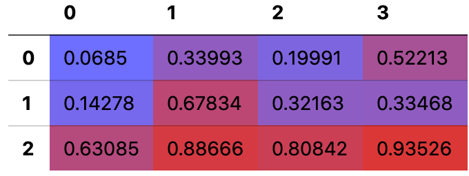
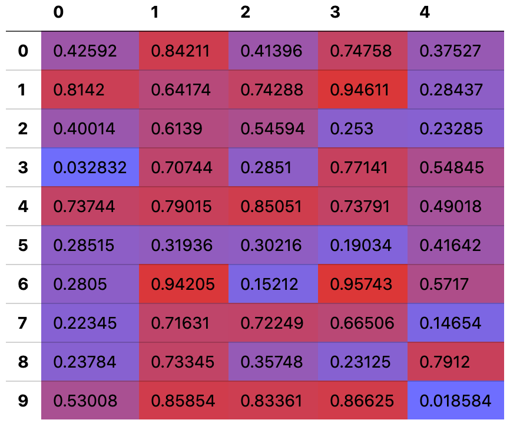

# ndpretty
> Your little helper to display numpy ndarrays in a pretty table in Jupyter notebooks.


Jupyter notebooks are a great way to develop. `ndpretty` makes it even better for people who use numpy by providing nice formatting of `ndarray`s.

## Install

`pip install ndpretty`

## How to use

```python
import ndpretty
import numpy as np
```

Display an ndarray using `ndarray_html()`:

```python
ndpretty.ndarray_html(np.random.rand(3, 4))
```



If you want all `np.ndarray`s and `torch.Tensor`s to be automatically formatted like this, load the default configuration:

```python
ndpretty.default()
```

After this line has been exectued, all cell outputs that are `np.ndarray` or `torch.Tensor` are automatically formatted by ndpretty.

```python
a = np.random.rand(10, 5)
a
```

    10×5 float64 ndarray



It works with all numpy dtypes, multi-dimensional arrays and PyTorch tensors.

Find more usage examples [here](https://deutschmn.github.io/ndpretty/ndpretty.html#Example-usages).

## Why?

Look at the [alternatives](https://deutschmn.github.io/ndpretty/alternatives.html).

## Author

Patrick Deutschmann ([patrick@deutschmann.xyz](mailto:patrick@deutschmann.xyz))
